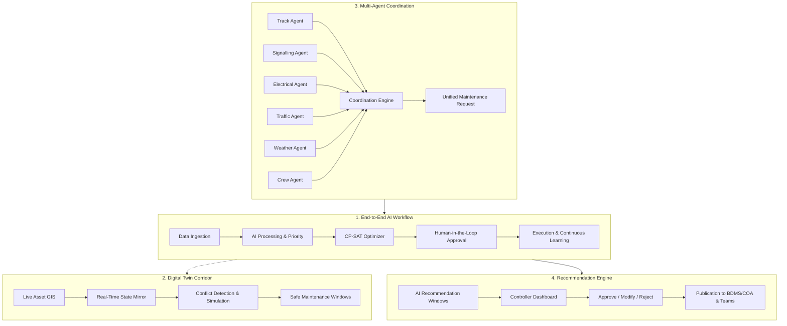

<div align="center">

# 🚆 RailSync — Intelligent Automatic Block Planning System

### *Predict · Plan · Keep India Moving*

**Smart India Hackathon 2026 — Problem Statement ID: SIH26027**  
**Theme:** Transportation & Logistics | **Category:** Software | **Team:** RailGorithm

[](https://nextjs.org/)
[](https://react.dev/)
[](https://fastapi.tiangolo.com/)
[](https://developers.google.com/optimization)
[](https://www.postgresql.org/)
[](https://kafka.apache.org/)
[](https://tailwindcss.com/)

---

</div>

## 📌 Executive Summary & Problem Context

On Indian Railways (IR), fixed-infrastructure maintenance is handled across three core engineering disciplines:
1. **Engineering (Track / P-Way):** Rail grinding, ballast tamping (CSM/BCM), weld inspection, rail renewals.
2. **Traction Distribution (Electrical / OHE):** Catenary tensioning, insulator washing, power block isolations.
3. **Signal & Telecommunication (S&T):** Point machine overhauls, digital axle counters, electronic interlocking diagnostics.

### The Operational Challenge
Under current manual practice via systems like **BDMS** (Block Demand & Management System), each department requests corridor track possessions (*maintenance blocks*) independently. Meanwhile, asset defects are stored in isolated silos (**TMS**, **TDMS**, **SMMS**) and train paths are regulated via the Control Office Application (**COA**).

```text
Current Decentralized Reality (Manual):
--------------------------------------------------------------------------------------
Engineering:           [10:00 - 12:00]  --> Line Shutdown #1 (2 hours)
Traction Distribution: [11:00 - 13:00]  --> Line Shutdown #2 (2 hours)
S&T (Signals):         [12:00 - 14:00]  --> Line Shutdown #3 (2 hours)
--------------------------------------------------------------------------------------
Result: 3 separate shutdowns totaling 6 hours of line closure, crippling train punctuality!
```

### The RailSync Solution
**RailSync** is an AI-powered, multi-agent decision-support platform that transforms decentralized block planning into a unified, data-driven optimization pipeline. It ingests cross-departmental defect streams, calculates explainable priority scores, and leverages **Google OR-Tools (CP-SAT)** to **merge isolated requests into synchronized, multi-departmental block possessions**, maximizing asset availability and eliminating unnecessary train disruptions.

```text
RailSync Optimized Coordinated Block:
--------------------------------------------------------------------------------------
Joint Possession:      [11:00 - 15:00]  --> Single Coordinated Window (4 hours)
                        ├─ Engineering: Cross-over tamping & weld testing
                        ├─ Traction:   Catenary droppers & insulator washing
                        └─ S&T:        Axle counter alignment & point overhaul
--------------------------------------------------------------------------------------
Result: 1 unified shutdown instead of 3; saves 2+ hours of corridor downtime per day!
```

---

## 🎯 4 Core Architectural Pillars

As outlined in the official SIH specification (`RailGorithm_SIH26027_RailSync.pdf`), RailSync is built around four foundational pillars:



1. **End-to-End AI Workflow:** Unifies data sources (TMS/SMMS/TDMS/COA), performs risk analysis, generates constraint-satisfying schedules, solicits controller approval, and continuously retrains from execution telemetry.
2. **Digital Twin Railway Corridor:** Live virtual replica of tracks, stations, signals, and trains along the corridor (modeled on the Agra Division: Delhi – Agra – Gwalior – Jhansi – Bina).
3. **Multi-Agent Coordination Engine:** Autonomous domain agents representing Track, Electrical, Signal, Operations, Weather, and Crew negotiating jointly to discover shared possession windows.
4. **Recommendation Engine Workflow:** Explainable recommendations delivered to the controller dashboard, retaining human authorization before dispatching work orders to BDMS.

---

## 🔬 7-Stage Technical Approach

RailSync implements the complete 7-stage end-to-end data and optimization pipeline:

```
[1. Data Integration] ──► [2. Digital Twin] ──► [3. AI Intelligence] ──► [4. Multi-Agent Coordination]
                                                                                   │
[7. Feedback & Learning] ◄── [6. Dashboards & Audit] ◄── [5. CP-SAT Optimizer] ◄──┘
```

### Stage 1: Data Integration Layer
- **Unified Railway Data Hub:** Ingests fragmented databases into a synchronized single source of truth.
- **FastAPI Endpoints:** Real-time ingestion endpoints for track defects, asset telemetry, and timetable changes.
- **Apache Kafka Streams:** Ingestion event buses (`rail.maintenance.tasks.v1`, `rail.traffic.schedules.v1`).
- **PostgreSQL & TimescaleDB:** Hybrid storage for relational asset graphs and time-series telemetry events.

### Stage 2: Digital Twin (Virtual Corridor)
- **GIS-Based Network:** High-fidelity spatial modeling of track geometry, signals, turnouts, and stations across corridors C-01 (Delhi–Agra), C-02 (Agra–Gwalior), C-03 (Gwalior–Jhansi), and C-04 (Jhansi–Bina).
- **Conflict Pre-Detection:** Detects line overlaps, headway violations, and resource gaps before physical possession.
- **What-If Simulation:** Evaluates scenarios such as monsoon rain delays, freight surges, or machine breakdowns.

### Stage 3: AI Intelligence Layer
- **Predictive Failure & RUL Models:** Machine learning models predict Remaining Useful Life (RUL) and failure probability.
- **Explainable Priority Score Formula:**
  $$\text{Priority Score} = 0.30 \cdot P_{\text{failure}} + 0.20 \cdot I_{\text{criticality}} + 0.20 \cdot D_{\text{traffic}} + 0.15 \cdot O_{\text{overdue}} + 0.15 \cdot H_{\text{failure}}$$
  - `0–30`: **LOW** (Routine periodic cycle)
  - `30–60`: **MEDIUM** (Upcoming monthly cycle)
  - `60–80`: **HIGH** (Action required within 48 hours)
  - `80–100`: **CRITICAL** (Urgent possession required < 24 hours)

### Stage 4: Multi-Agent AI Coordination
Six autonomous agents negotiate collaboratively to synthesize joint maintenance proposals:
- 🛤️ **Track Agent:** Advocates for tamping, rail renewals, deep screening, and ultrasonic testing.
- ⚡ **Electrical (OHE) Agent:** Manages catenary inspections, neutral sections, and power isolation permits.
- 🚦 **Signalling (S&T) Agent:** Schedules point machine servicing, track circuits, and electronic interlocking diagnostics.
- 🚆 **Traffic Agent:** Evaluates COA timetable headways, passenger train priorities (Rajdhani/Shatabdi), and freight flow.
- 🌦️ **Weather Agent:** Monitors rainfall, temperature extremes, fog, and track buckling risk.
- 👷 **Crew & Machine Agent:** Allocates departmental gangs, track tampers (CSM-952), ballast cleaners (BCM-303), and tower wagons (TW-04).

### Stage 5: CP-SAT Optimization Engine
Uses **Google OR-Tools CP-SAT (Constraint Programming - Satisfiability)** to solve a multi-objective constraint model:
- **No-Collision Invariant:** Possession windows must never overlap active train occupancies on the same track.
- **Crew Feasibility:** Qualified maintenance gangs and required heavy machinery must be on duty.
- **Possession Bundling:** Maximizes the number of cross-departmental tasks bundled per corridor closure.
- **Minimization of Freight Regulation:** Restricts train hold times at loop sidings to operational tolerances.

### Stage 6: Modern Controller Dashboard & Notifications
- Role-based operational views for Section Controllers, Divisional Engineers, and Gang Supervisors.
- Interactive time-distance charts, weekly matrix planners, and Explainable AI factor modals.
- Real-time audit trails with export capability (CSV, PDF, JSON).

### Stage 7: Continuous Feedback & Model Retraining
- Compares actual execution duration vs. planned block window.
- Ingests track quality index (TQI) improvements and speed restriction lift reports.
- Incrementally updates priority feature weights and CP-SAT duration heuristics.

---

## 💻 Tech Stack & Architecture

| Domain | Technologies |
|---|---|
| **Frontend Framework** | [Next.js 16](https://nextjs.org/) (App Router, Turbopack), [React 19](https://react.dev/), [TypeScript](https://www.typescriptlang.org/) |
| **UI Components & Styling** | [Tailwind CSS v4](https://tailwindcss.com/), [Base UI](https://base-ui.com/) (`@base-ui/react`), [Lucide Icons](https://lucide.dev/) |
| **Visualizations & Maps** | [Recharts](https://recharts.org/), [Leaflet](https://leafletjs.com/) & [React-Leaflet](https://react-leaflet.js.org/), PostGIS GeoJSON |
| **Backend API** | [Python 3.12](https://www.python.org/), [FastAPI](https://fastapi.tiangolo.com/), [Uvicorn](https://www.uvicorn.org/), [Pydantic v2](https://docs.pydantic.dev/) |
| **Mathematical Optimization** | [Google OR-Tools](https://developers.google.com/optimization) (CP-SAT Solver) |
| **Streaming & Data Processing** | [Apache Kafka](https://kafka.apache.org/), [Pandas](https://pandas.pydata.org/), [GeoPandas](https://geopandas.org/) |
| **Databases** | [PostgreSQL 16](https://www.postgresql.org/), [TimescaleDB](https://www.timescale.com/), [Prisma ORM](https://www.prisma.io/) |
| **DevOps & Deployment** | [Docker](https://www.docker.com/), Docker Compose, Azure Container Apps readiness |

---

## 🗺️ Project Structure

```text
sih-2026/
├── frontend/                         # Next.js 16 + React 19 Frontend
│   ├── app/
│   │   ├── (dashboard)/
│   │   │   ├── overview/             # Executive Mission Control Center
│   │   │   ├── maintenance/tasks/    # TMS/SMMS/TDMS Task Prioritization
│   │   │   ├── block-planning/ai-planner/ # CP-SAT Automatic Block Generator
│   │   │   ├── digital-twin/         # GIS Corridor Map & Real-time Twin
│   │   │   ├── ai-insights/          # Predictive Risk, Scenarios & Attribution
│   │   │   └── plan/                 # Plan Review, Weekly Matrix & Approval
│   ├── components/
│   │   ├── ai-insights/              # Modular Explainable AI feature suite
│   │   ├── ai-planner/               # Block schedule Gantt & solver cards
│   │   ├── dashboard/                # Reusable KPI stats, section headers
│   │   ├── maintenance/              # Task registry, department filters
│   │   ├── plan/                     # Weekly matrix, table, approval dialog
│   │   ├── sidebar/                  # Navigation & Add New request dialog
│   │   └── ui/                       # Base UI / shadcn design system primitives
│   └── package.json
│
├── backend/                          # FastAPI Backend Services
│   ├── api/                          # REST routes (assets, events, maintenance, tracks, trains)
│   ├── config.py                     # Environment & database settings
│   ├── database.py                   # Connection pools & query helpers
│   └── main.py                       # FastAPI application entrypoint
│
├── ai/                               # Machine Learning & AI Intelligence
│   ├── priority.py                   # Explainable priority scoring algorithm
│   └── __init__.py
│
├── optimizer/                        # Mathematical Scheduling Engine
│   ├── scheduler.py                  # Google OR-Tools CP-SAT solver implementation
│   └── __init__.py
│
├── database/                         # Relational & Time-Series Schemas
│   ├── schema.sql                    # PostgreSQL / PostGIS DDL tables
│   └── seed.py                       # Synthetic railway dataset generator
│
├── docker-compose.yml                # Multi-container orchestration (PostgreSQL / Timescale)
├── requirements.txt                  # Python dependencies
├── AGENTS.md                         # Multi-agent coordination specification
├── DESIGN.md                         # System design document
└── RailGorithm_SIH26027_RailSync.pdf # Official SIH presentation document
```

---

## 🚀 Quickstart & Installation

### Prerequisites
- **Node.js**: `>= 20.x`
- **Python**: `>= 3.11`
- **Docker**: For PostgreSQL & PostGIS (optional for local mock data)

### 1. Clone the Repository
```bash
git clone https://github.com/YourOrg/sih-2026.git
cd sih-2026
```

### 2. Set Up Environment Variables
Create a root `.env` file (refer to `.env.example`):
```env
# Database
POSTGRES_USER=postgres
POSTGRES_PASSWORD=postgres
POSTGRES_DB=railsync
POSTGRES_HOST=localhost
POSTGRES_PORT=5432

# Backend
API_HOST=0.0.0.0
API_PORT=8000
ENVIRONMENT=development

# Frontend
NEXT_PUBLIC_API_URL=http://localhost:8000
```

### 3. Start Backend Services
```bash
# Optional: Start PostgreSQL via Docker
docker compose up -d

# Create & activate Python virtual environment
python -m venv .venv
# Windows:
.venv\Scripts\activate
# Linux/macOS:
source .venv/bin/activate

# Install dependencies
pip install -r requirements.txt

# Run the FastAPI server
uvicorn backend.main:app --reload --port 8000
```
Backend API docs will be live at: `http://localhost:8000/docs`

### 4. Start the Frontend
```bash
cd frontend

# Install Node dependencies
npm install

# Start Next.js development server
npm run dev
```
Open your browser at: `http://localhost:3000`

---

## 📊 Application Dashboard Highlights

### 1. Executive Overview (`/overview`)
- High-level KPIs: Active Corridor Possession, Network Asset Availability (98.4%), Multi-Dept Bundling Ratio, and Train Punctuality Index.
- Live Corridor Activity Feed and Real-time Traffic Headway.

### 2. Maintenance Management (`/maintenance/tasks`)
- Unified defect repository ingesting records from TMS, SMMS, and TDMS.
- Interactive filtering by department, priority, corridor, and machine requirement.
- One-click block bundling trigger.

### 3. AI Block Planner (`/block-planning/ai-planner`)
- Interactive Google OR-Tools CP-SAT scheduler.
- Displays timetable occupancies against candidate maintenance windows.
- Generates optimal schedule with zero train cancellations and maximum resource utilization.

### 4. Digital Twin Corridor (`/digital-twin`)
- GIS-based corridor map of the Agra Division (Delhi–Bina).
- Visualizes real-time train positions, track possession boundaries, and asset health status.

### 5. AI Insights & Explainable AI (`/ai-insights`)
- Feature attribution breakdown showing mathematical influence of failure risk, criticality, traffic density, and overdue maintenance.
- Interactive What-If Scenario simulator for operational contingency testing.

### 6. Plan Review & Approval (`/plan`)
- Corridor × Day weekly schedule matrix.
- Timetable conflict analysis and single-possession bundling review.
- Electronic authorization workflow with controller endorsement and BDMS/COA dispatch.

---

## 📚 Academic Research & Standards Foundation

RailSync is designed upon established academic literature in railway operations research and official Indian Railways operating manuals:

1. **Lidén & Joborn (2017):** *An optimization model for integrated planning of railway traffic and network maintenance.* Transportation Research Part C: Emerging Technologies.
2. **Zhang et al. (2019):** *Microscopic optimization model integrating train timetabling and track maintenance scheduling.* Computers & Industrial Engineering.
3. **Budai, Huisman, & Dekker (2006):** *Scheduling preventive railway maintenance activities & clustering tasks efficiently.* Journal of the Operational Research Society.
4. **Prasad & Jamuar / Fatima et al. (2026):** *Frameworks for predictive maintenance priority scoring in complex linear infrastructure.*
5. **Indian Railways Operating Codes:**
   - *Indian Railways Permanent Way Manual (IRPWM)*
   - *Indian Railways Traction Distribution Manual (TDMS/ACTM)*
   - *Signal Engineering Manual (SEM)*
   - *General & Subsidiary Rules (GR/SR) for Block Working & Safety Possessions*

---

## 👥 Team RailGorithm — Smart India Hackathon 2026

- **Project Lead & AI/Optimization Architecture**
- **Frontend & UI/UX Systems**
- **Data Engineering & Streaming Pipeline**
- **Railway Domain Modeling & Mathematical Validation**

---

<div align="center">

**Built with pride for Indian Railways · Smart India Hackathon 2026**  
*Smarter Maintenance. Less Disruption. Safer Railway.*

</div>
